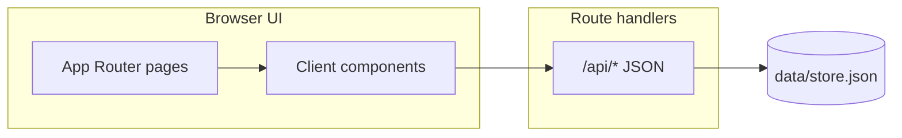

# Personal dashboard — technical reference

Companion to the main [README.md](README.md). This document describes architecture, persistence, public keys, HTTP APIs, and where logic lives in the codebase.

---

## Stack

| Layer | Choice |
|-------|--------|
| Framework | Next.js 16 (App Router) |
| Runtime | Node.js 20+ |
| UI | React 19, Tailwind CSS 4 |
| Validation | Zod 4 |
| Markdown | `react-markdown`, remark/rehype (see [docs/MARKDOWN.md](docs/MARKDOWN.md)) |
| Widgets | MUI 9 (theme switch, some dashboard controls) |

Scripts (see [package.json](package.json)):

| Command | Purpose |
|---------|---------|
| `npm run dev` | Dev server (`next dev -H localhost`). |
| `npm run build` | Production build; runs TypeScript as part of Next. |
| `npm run start` | Serve production build. |
| `npm run lint` | ESLint. |
| `npm run mock:screenshots` | `cp data/store.screenshots.json data/store.json` for a fixture dataset. |

---

## Architecture

- **Pages** under [`app/`](app/) are mostly thin shells; interactive behavior lives in [`components/*Client.tsx`](components/).
- **Mutations** use `POST` / `PATCH` / `DELETE` on [`app/api/`](app/api/). Handlers call `mutateStore` from [`lib/jsonStore.ts`](lib/jsonStore.ts) so the JSON file and in-memory snapshot stay consistent; audit rows append where implemented.
- **Reads** use `readStore()` inside route handlers (or data passed into server components where applicable).

### Theming

Initial theme is applied early via [`lib/themeStorage.ts`](lib/themeStorage.ts) and an inline script in [`app/layout.tsx`](app/layout.tsx). The nav can show either a compact MUI switch or the “landscape” toggle depending on [`components/SettingsClient.tsx`](components/SettingsClient.tsx) / store settings.

---

## Persistence

### `data/store.json`

- Primary path: **`data/store.json`** (created on first write if missing).
- Root shape is validated by **`storeSchema`** in [`lib/schemas.ts`](lib/schemas.ts): owners, projects, task groups (epics), tasks, owner entries (notes), worklogs, settings, audit log, etc.
- **Backups:** treat this file as the database; copy it before bulk edits or schema experiments.

### Legacy migration

[`lib/storeMigrateLegacy.ts`](lib/storeMigrateLegacy.ts) runs **before** Zod parse on read. It normalizes renamed fields (e.g. historical `partners` → `owners`), fills defaults, assigns missing **`key`** fields on entities, and for **notes** without keys assigns `allocateNoteEntryKey(parent)` when `ownerId` / `projectId` resolves to a parent with a valid key, else `allocateEntityKey("NTE", used)`.

---

## Public keys (`key`)

Every major entity has:

- **`id`**: UUID, stable internal primary key.
- **`key`**: human-facing reference string, **immutable** after creation in normal use. URLs and many APIs accept **either** UUID or `key` (see [`lib/resolveEntityId.ts`](lib/resolveEntityId.ts)).

### Formats ([`lib/entityKey.ts`](lib/entityKey.ts))

1. **Standard (non-note):** `[A-Z]{2,16}-\d{1,N}` where **N = `ENTITY_KEY_DIGIT_SUFFIX_MAX`** (32) — e.g. `ONE-3`, `RBRAND-435343`, or a longer custom tag within that letter bound.
2. **Legacy (still accepted):** `[A-Z]{2,16}-[A-Z0-9]{6}` — six-character suffix from the older alphabet.
3. **Note (child of owner/project):** parent’s full key + `-` + `\d{1,N}` — e.g. `ONE-3435-44` (parent must not already be a note-child key).

Zod uses `ENTITY_KEY_REGEX` from the same module; `isValidEntityKey` / `isNoteChildKey` implement the three-way acceptance rules. The digit cap is a safety bound for imports and URLs, not a UX target—anything from a single digit upward (within the cap) is valid.

### Allocation

- **Owners, projects, epics, tasks, worklogs:** `allocateEntityKey(tag, used)` after optional `normalizeKeyTag(body.keyTag, defaultTag)` — see [`lib/apiEntityKey.ts`](lib/apiEntityKey.ts) `nextEntityKey`.
- **Notes:** `nextOwnerEntryKey(store, { ownerId, projectId })` — if `ownerId` is set and that owner has a valid non–note-child key, that key is the parent; else if `projectId` is set, the project’s key; else standalone `NTE-<digits>`. Implementation: `allocateNoteEntryKey` in `entityKey.ts`.

### `keyTag` on create APIs

Optional **`keyTag`** (2–16 letters A–Z) on create for **owners**, **projects**, **epics**, **tasks**, **worklogs** — not used for **note** creation (note keys follow parents). Constants: `ENTITY_KEY_TAG_MIN` / `ENTITY_KEY_TAG_MAX` in [`lib/entityKeyNormalize.ts`](lib/entityKeyNormalize.ts). Normalization: [`normalizeKeyTag`](lib/entityKeyNormalize.ts). UI: [`components/EntityKeyTagInput.tsx`](components/EntityKeyTagInput.tsx).

---

## Wiki links

[`lib/wikiLinkPreprocess.ts`](lib/wikiLinkPreprocess.ts) rewrites `[[...]]` patterns before Markdown render. Identifiers may be UUIDs or any accepted `key` shape (including note child keys). Grammar and examples: [docs/MARKDOWN.md](docs/MARKDOWN.md), in-app [`app/docs/markdown/page.tsx`](app/docs/markdown/page.tsx).

---

## Notable feature modules

| Area | Primary code |
|------|----------------|
| Dashboard / tasks | [`components/HomeClient.tsx`](components/HomeClient.tsx) |
| Global search | [`components/GlobalSearch.tsx`](components/GlobalSearch.tsx), [`app/api/search/route.ts`](app/api/search/route.ts), [`lib/dashboardSearch.ts`](lib/dashboardSearch.ts) |
| Note attribution rules | [`lib/noteAttribution.ts`](lib/noteAttribution.ts) |
| Worklog duration parsing | Jira-style strings; minutes-per-day from settings |
| Achievements + worklog slice | [`lib/achievements.ts`](lib/achievements.ts), [`lib/achievementsWorklogs.ts`](lib/achievementsWorklogs.ts), [`app/achievements/page.tsx`](app/achievements/page.tsx) |
| Audit | [`lib/auditLog.ts`](lib/auditLog.ts), [`app/api/audit/route.ts`](app/api/audit/route.ts), [`app/audit/page.tsx`](app/audit/page.tsx) |
| Settings | [`app/api/settings/route.ts`](app/api/settings/route.ts), [`components/SettingsClient.tsx`](components/SettingsClient.tsx) |

---

## HTTP API index (representative)

Exact bodies are validated with Zod in each route file.

| Method | Path | Role |
|--------|------|------|
| GET/POST | `/api/owners` | List / create owners (`keyTag` optional on POST). |
| GET/PATCH/DELETE | `/api/owners/[id]` | Owner by UUID or key. |
| GET/POST | `/api/projects` | List / create projects (`keyTag` optional). |
| GET/PATCH/DELETE | `/api/projects/[id]` | Project by id or key. |
| GET/POST | `/api/owners/[id]/groups` | Epics for owner (`keyTag` optional on POST). |
| GET/PATCH/DELETE | `/api/groups/[id]` | Epic by id or key. |
| GET/POST | `/api/tasks` | Tasks (`keyTag` optional on POST). |
| GET/PATCH/DELETE | `/api/tasks/[id]` | Task by id or key. |
| GET/POST | `/api/entries` | List / create notes (key assigned server-side from parent). |
| GET/PATCH/DELETE | `/api/entries/[id]` | Note by id or key. |
| GET/POST | `/api/owners/[id]/entries` | Notes for owner / create (nested create). |
| GET/POST | `/api/projects/[id]/entries` | Notes for project / create (nested create). |
| GET/POST | `/api/worklogs` | List (query filters) / create (`keyTag` optional). |
| GET/PATCH/DELETE | `/api/worklogs/[id]` | Worklog by id or key. |
| GET | `/api/search?q=` | Global search (substring, capped). |
| GET | `/api/audit` | Audit entries. |
| GET/PATCH | `/api/settings` | Read / partial update settings. |
| GET | `/api/store` | Download full store as dated JSON attachment. |
| POST | `/api/store` | Replace entire store (body must pass `storeSchema`). |

---

## Troubleshooting

| Symptom | Things to check |
|---------|-------------------|
| Build / parse fails on store | Restore a backup `store.json` or run `npm run mock:screenshots`. |
| `readStore` / Zod errors | Invalid JSON or post-migration shape; inspect [`lib/storeMigrateLegacy.ts`](lib/storeMigrateLegacy.ts) and [`lib/schemas.ts`](lib/schemas.ts). |
| Search returns nothing | Query length ≥ 1; only local store is indexed. |

---

## Contributor notes

- Next.js version notes: [AGENTS.md](AGENTS.md) points at in-repo Next docs under `node_modules/next/dist/docs/` when APIs differ from older Next versions.
